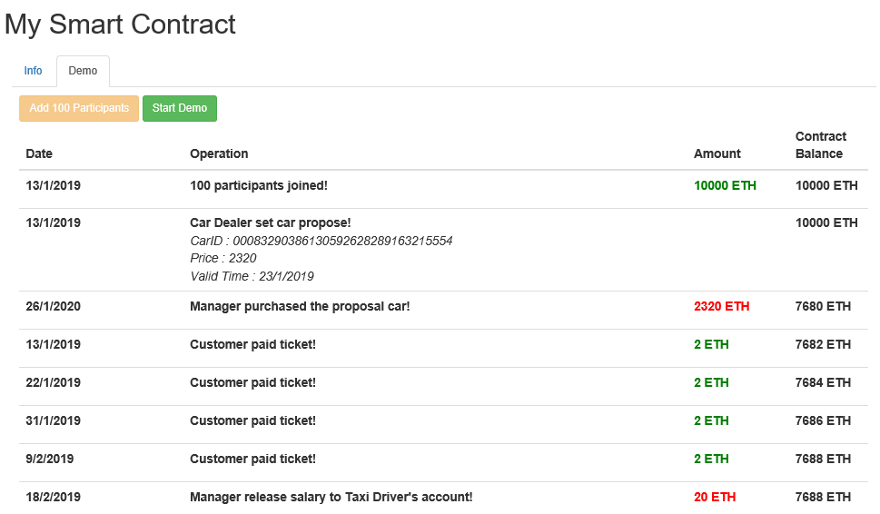

# Taxi Smart Contract Application
This is Web Based Ethereum Smart Contract Application on Web3 Provider. Smart Contracts work on Ethereum blockchain and perform what we
program. Ethereum Virtual Machine (EVM) presents opportunity to run Smart Contract. Besides it ensures isolation to keep whole networks
security if any problem occured. Solidity language is improved to program Smart Contracts.

In this application, we developed Smart Contract on [Remix IDE](https://remix.ethereum.org/) and it is run on
[Ganache CLI](https://github.com/trufflesuite/ganache-cli) that is help to simulate full client behavior. Although there are many
Ethereum Development Tool such as Ganache CLI, Ganache CLI was used due to it presents configuration opportunity on TestRPC environment
such as changing account numbers or balances.

## Configuration

To demonstration, firstly we need to install Ganache CLI as Web3 Provider. Below command help to install it.
```
npm install -g ganache-cli
```

Then we can start it with below command. We use –a and –e parameters to change account number and balance amount we use in demonstration.
We generate 130 accounts and each account has 200 ether as default balance.
```
ganache-cli –a 130 –e 200
```

After install and run Ganache CLI, we need to deploy our Smart Contract and make change on ABI and Smart Contract Address at code.
ABI hold Smart Contract's description and just change whenever we change something on Contract. Also Smart Contract Address changes
whenever we deploy it. We need to open .sol file at Remix IDE then it should be build with version 0.4.23 as you see in code. After build
.sol file we deploy Smart Contract and copy Smart Contract’s address from Remix IDE to AppContractJSON.js file in js directory.
In AppContractJSON.js file we have 2 variables that named are ContractAddress and ABI.

## Demonstration

After above configuration steps, we can execute main.html file on Internet Explorer. Some trouble may occur while html is executed
on other browser such as Chrome, Opera. When execute main.html, Info tab welcome. Info tab’s screenshot placed below. As you see, we
can initiate Manager, CarDealer, and Driver’s info but it can change at this tab.
- Driver Cap : This is monthly salary of Driver and only Manager can alter it.
- Ticket Price : This is taxi ticket price that is used by customer


After all initialization, we can select Demo tab. Demo tab’s screenshot placed below. With **Add 100 Participants** button that is yellow,
is shortcut to easily add 100 participants to contract from accounts we have created with Ganache CLI. After adding participants to
Contract, **Start Demo** button is activated.


A few times later, demonstration is finished and all logs are appended to screen as a table below. It can takes 7-8 seconds and
logs append at finish not simultaneously. Contract accepts money from customer and calculate profit or salary monthly. Then it works
how we initialise. At the same time, Contract blocks Manager activities if Manager tries to do anomalies.


